# PetHealth Mobile — Frontend

Aplikacja mobilna do zarządzania zdrowiem zwierząt domowych, stworzona w React Native (TypeScript).

---

## Technologie

- React Native 0.85
- TypeScript
- React Navigation (Stack + Bottom Tabs)
- Axios (komunikacja z API)
- AsyncStorage (przechowywanie tokena JWT)
- React Native Vector Icons (MaterialCommunityIcons)
- React Native Chart Kit (wykres wagi)
- React Native Linear Gradient
- React Native Image Picker (zdjęcia zwierząt)
- @react-native-documents/picker (załączniki PDF/zdjęcia)

---

## Wymagania

- Node.js 18+
- Java JDK 17
- Android Studio z emulatorem (API 34+)
- Uruchomiony backend PetHealthApp na porcie 5081

---

## Instalacja i uruchomienie

1. Sklonuj repozytorium:
```
   git clone https://github.com/WiktoriaRadzanowska/PetHealthApp-frontend.git
   cd PetHealthApp-frontend
```

2. Zainstaluj zależności:
```
   npm install
```

3. Uruchom emulator Android w Android Studio 

4. Terminal 1 — Metro bundler:
```
   npm start
```

5. Terminal 2 — build i instalacja na emulatorze:
```
   npm run android
```

---

## Połączenie z backendem

Adres backendu konfigurowany w `src/api/apiClient.ts`:

```typescript
// Emulator Android
const BASE_URL = 'http://10.0.2.2:5081';

// Urządzenie fizyczne — zmień na IP swojego komputera
// const BASE_URL = 'http://192.168.1.X:5081';
```

---

## Struktura projektu

```
src/
├── api/
│   ├── apiClient.ts       # Konfiguracja Axios + interceptor JWT
│   ├── authApi.ts         # Logowanie i rejestracja
│   ├── petsApi.ts         # Zwierzęta
│   ├── visitsApi.ts       # Wizyty
│   ├── weightApi.ts       # Historia wagi
│   └── usersApi.ts        # Profil użytkownika
├── components/
│   ├── Button.tsx         # Przycisk 
│   ├── Input.tsx          # Pole tekstowe z ikoną i obsługą hasła
│   ├── PetCard.tsx        # Karta zwierzaka
│   └── VisitItem.tsx      # Element listy wizyt
├── context/
│   └── AuthContext.tsx    # Globalny stan autoryzacji (JWT, auto-login)
├── navigation/
│   └── AppNavigator.tsx   # Stack + Bottom Tab nawigacja
├── screens/
│   ├── auth/
│   │   ├── LoginScreen.tsx
│   │   └── RegisterScreen.tsx
│   ├── DashboardScreen.tsx
│   ├── PetSelectScreen.tsx
│   ├── PetDetailScreen.tsx
│   ├── AddPetScreen.tsx
│   ├── EditPetScreen.tsx
│   ├── ManagePetsScreen.tsx
│   ├── HealthBookScreen.tsx
│   ├── VisitDetailScreen.tsx
│   ├── AddVisitScreen.tsx
│   ├── EditVisitScreen.tsx
│   ├── WeightScreen.tsx
│   ├── SettingsScreen.tsx
│   ├── ChangePasswordScreen.tsx
│   └── AccountInfoScreen.tsx
├── theme/
│   └── colors.ts          # Paleta kolorów i typy wizyt
└── types/
    └── index.ts           # Typy TypeScript (User, Pet, Visit, itp.)
```

---

## Ekrany aplikacji

### 01 — Logowanie
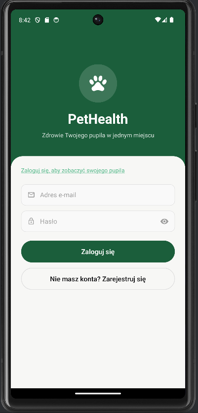

Ekran logowania z polami email i hasło. Nawigacja do rejestracji.

---

### 02 — Rejestracja
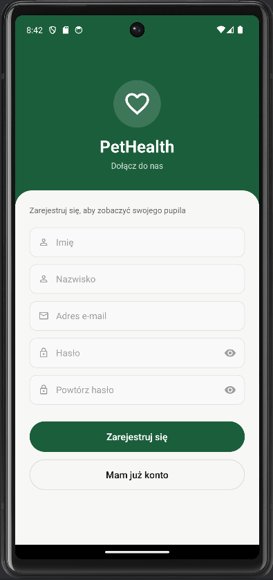

Formularz rejestracji nowego użytkownika. Pola: imię, nazwisko, email, hasło, powtórz hasło.

---

### 03 — Wybór zwierzaka
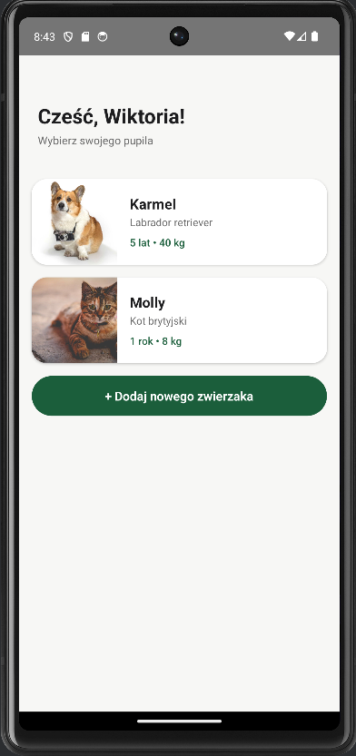

Lista zwierząt przypisanych do konta z zdjęciem, imieniem, rasą, wiekiem i wagą. Przycisk dodania nowego zwierzaka.

---

### 04 — Dashboard
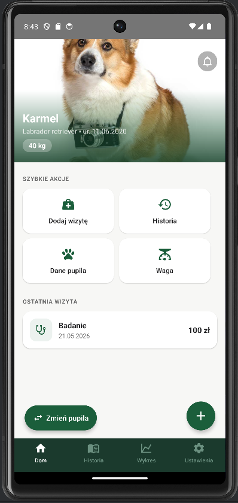

Główny ekran z zdjęciem pupila i gradientem. Szybkie akcje: Dodaj wizytę, Historia, Dane pupila, Waga. Ostatnia wizyta. Przycisk zmiany pupila i dodania wizyty.

---

### 05 — Książeczka zdrowia
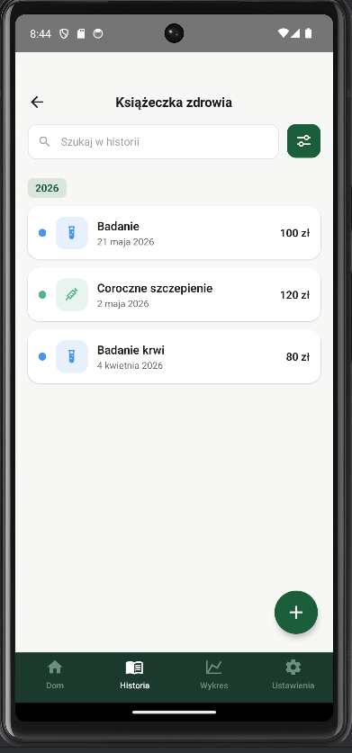

Lista wizyt pogrupowana po roku z kolorowymi dotami dla każdego typu wizyty. Wyszukiwarka po tytule. Przycisk filtrowania.

---

### 06 — Filtry wizyt
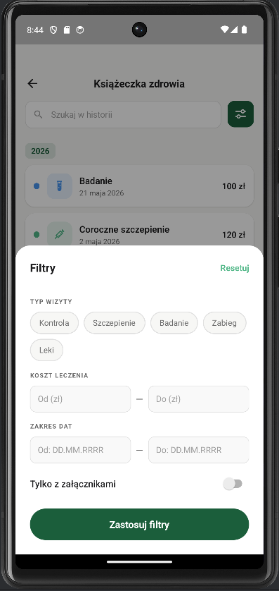

Modal z filtrami:
- Typ wizyty (Kontrola, Szczepienie, Badanie, Zabieg, Leki)
- Koszt leczenia (zakres od–do)
- Zakres dat (od–do)
- Tylko z załącznikami (toggle)

---

### 07 — Szczegóły wizyty
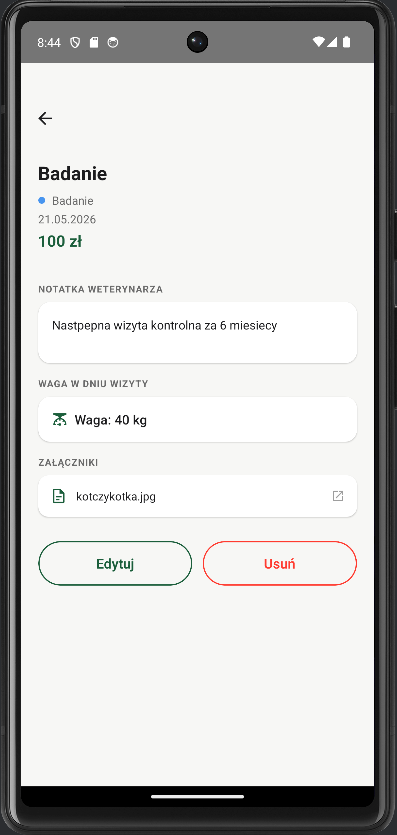

Tytuł, typ, data i koszt wizyty. Notatka weterynarza. Waga w dniu wizyty. Lista załączników z możliwością otwarcia. Przyciski edycji i usunięcia.

---

### 08 — Dodaj wizytę
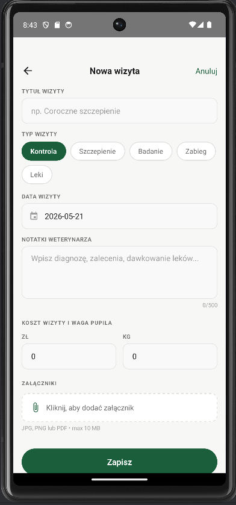

Formularz nowej wizyty: tytuł, typ, data, notatki weterynarza, koszt, waga, załączniki (PDF i zdjęcia).

---

### 09 — Edytuj wizytę
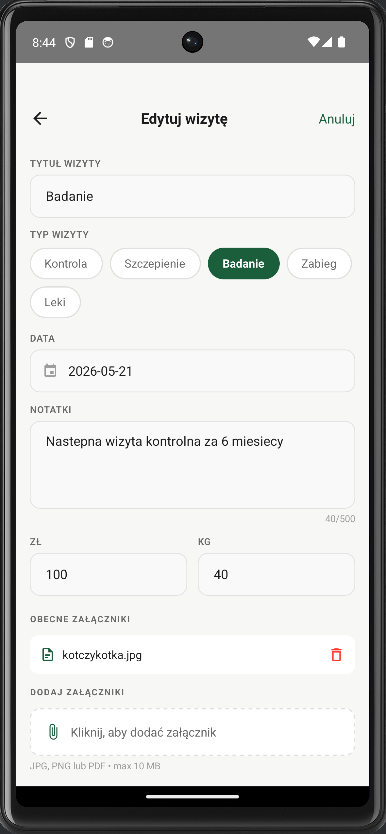

Formularz edycji z wypełnionymi danymi. Zarządzanie istniejącymi załącznikami (usuwanie). Dodawanie nowych załączników.

---

### 10 — Wykres wagi
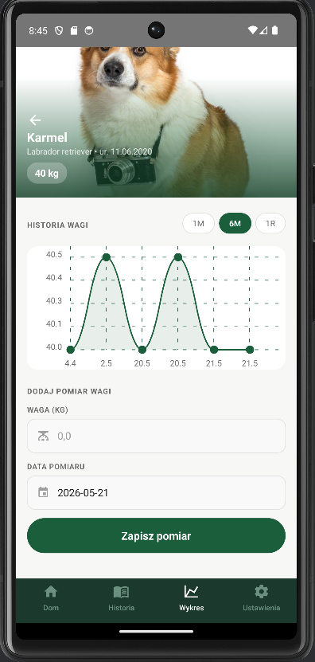

Zdjęcie pupila z gradientem. Wykres liniowy historii wagi. Filtry zakresu: 1M, 6M, 1R. Formularz dodania nowego pomiaru z datą.

---

### 11 — Dane pupila
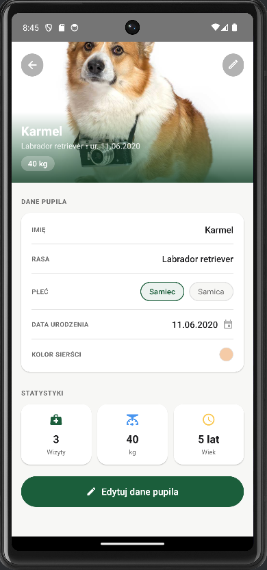

Zdjęcie pupila z gradientem. Karta z danymi: imię, rasa, płeć (chipy), data urodzenia, kolor sierści. Statystyki: liczba wizyt, waga, wiek. Przycisk edycji.

---

### 12 — Dodaj zwierzaka
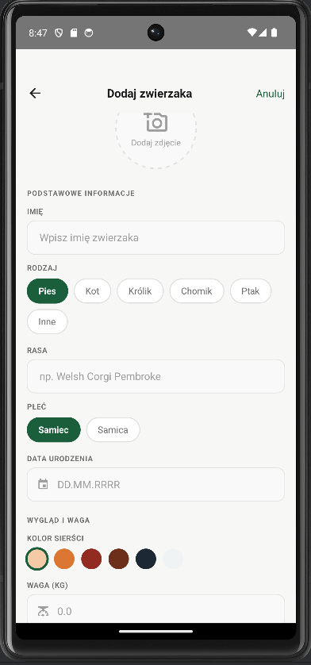

Formularz dodania nowego zwierzaka: zdjęcie z galerii, imię, rodzaj (Pies/Kot/Królik/Chomik/Ptak/Inne), rasa, płeć, data urodzenia, kolor sierści, waga.

---

### 13 — Edytuj zwierzaka
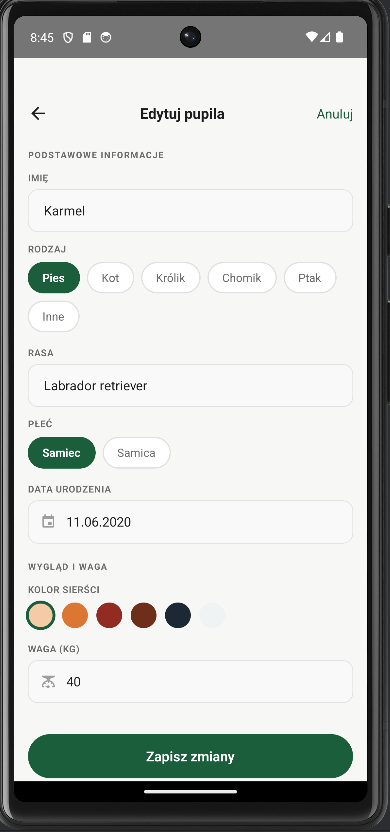

Formularz edycji z wypełnionymi danymi pupila. Automatyczne wczytanie aktualnych danych z backendu.

---

### 14 — Ustawienia
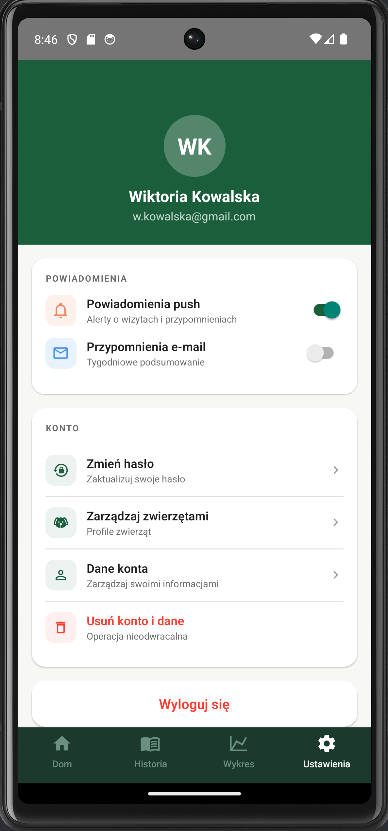

Avatar z inicjałami użytkownika. Powiadomienia push i email (toggle). Menu: Zmień hasło, Zarządzaj zwierzętami, Dane konta, Usuń konto i dane. Przycisk wylogowania.

---

### 15 — Zarządzaj zwierzętami
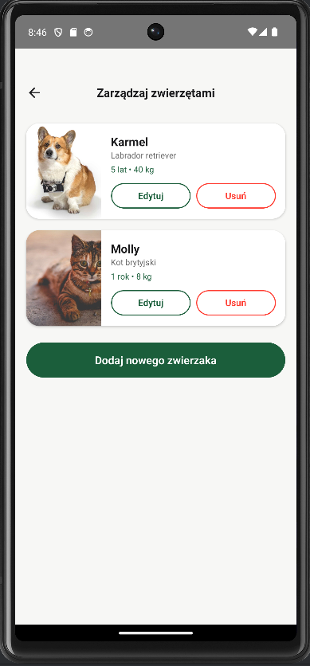

Lista zwierząt z zdjęciem, imieniem, rasą, wiekiem i wagą. Przyciski Edytuj i Usuń dla każdego zwierzaka. Przycisk dodania nowego zwierzaka.

---

### 16 — Dane konta
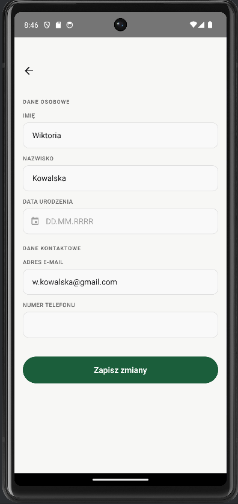

Formularz z danymi osobowymi: imię, nazwisko, data urodzenia. Dane kontaktowe: email (nieedytowalny), numer telefonu. Przycisk zapisania zmian.

---

### 17 — Zmień hasło
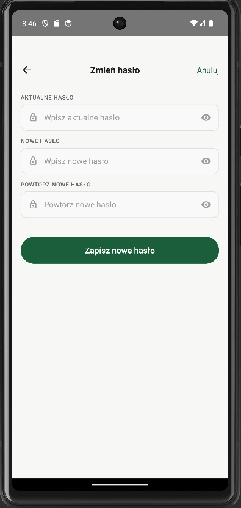

Formularz zmiany hasła: aktualne hasło, nowe hasło, powtórz nowe hasło. Walidacja zgodności haseł.

---
